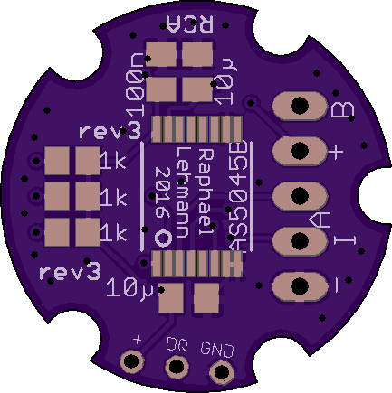
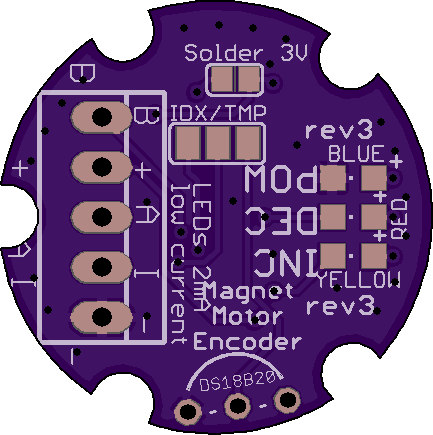
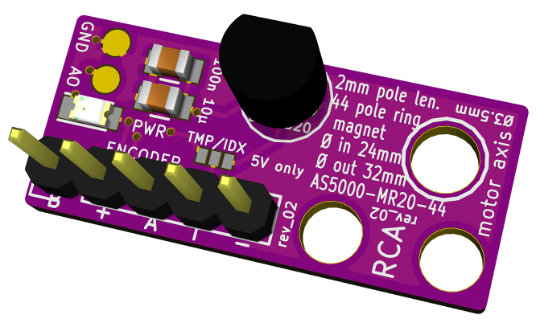
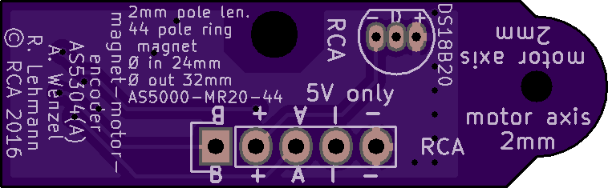
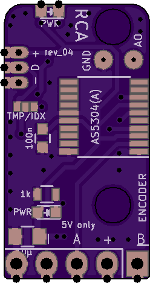

# magnet-motor-encoder

## board-as5045b

### Motorencoder für axial befestigten diametralen Magneten

Motor-Encoder mit **ams** AS5045B.

Der AS5045B ist ein IC welcher die Ausrichtung eines über ihm befindlichen Magneten mit 12 Bit Auflösung erfasst.
Die Platine ist hat exakt 22mm Durchmesser und sollte damit zu den *Namika* Motoren (ebenfalls 22mm Durchmesser) passen.

An der Motorachse muss ein Ø 6 mm x 2.5 mm Magnet mit diametraler Orientierung befestigt werden, die zulässige Toleranz betrögt 0.1 mm.
Das Magnet ist exakt mittig über dem IC (welcher mittig auf der Platine platziert ist) ausgerichtet werden, der Toleranzbereich beträgt hier 0.25mm.

### Diagnose LEDs
* Blaue LED: Power
* Rote und gelbe LEDs: Magnetfeldstärke
  * Aus: optimaler Betrieb
  * Gelb leuchtet: schwache Magnetfeldstärke, Magnet näher an IC platzieren.
  * Rot und Gelb leuchten: zu starkes oder zu schwaches Magnetfeld, keine zuverlässiger Betrieb möglich.

## board-as5304

### Motorencoder für axial befestigten mehrpoligen Ringmagneten

Motor-Encoder mit **ams** AS5304(A).

Der AS5304 ist ein IC welcher die Bewegung eines über ihm befindlichen mehrpoligen Magneten mit 160 Schritten pro Magnetpolpaar erfasst.
Die Platine ist hat etwa 12 mm Höhe und 39 mm Breite sowie ein 2mm Loch zu Ausrichtung über der Motorwelle.
Bei Bedarf kann dieses Loch aufgebohrt werden, in der Umgebung sind keine Leiterbahnen und kein Kupfer vorhanden.

An der Motorachse muss ein Ringmagnet mit 24 mm Innendurchmesser und 32 mm Außendurchmesser (-> MIttendurchmesser 28 mm) mittels eines nicht ferromagmetischen Werkstoffs befestigt werden.
Das Sensorarray im IC befindet sich exakt 28 mm vom Loch für die Motorachse entfernt, sodass die Platine bei Verwendung des oben genannten Magneten nur an der Motorachse und mit ca. 0.5 mm zum Ringmagnet ausgerichtet werden muss.

### Diagnose
* Blaue LED: Power
* Am Testpoint **AO** kann eine von der Magnetfeldstärke abhängige Spannung (gegen Testpoint **GND**) gemessen werden.

## License

Copyright Raphael Lehmann 2016

Licensed under CERN OHL v.1.2
